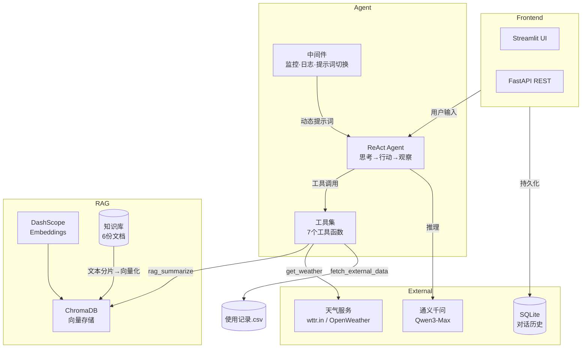

# 智扫通机器人智能客服 🤖

基于 **LangChain ReAct Agent + RAG** 的扫地机器人智能客服系统，支持实时对话、知识库检索、使用报告生成、天气查询等功能。

---

## 技术栈

| 层级 | 技术 |
|------|------|
| **LLM** | 通义千问 Qwen3-Max (DashScope) |
| **Agent 框架** | LangChain ReAct Agent (Thought→Action→Observation 循环) |
| **RAG 向量库** | ChromaDB + DashScope Embeddings (text-embedding-v4) |
| **前端** | Streamlit |
| **后端 API** | FastAPI + Uvicorn |
| **数据持久化** | SQLAlchemy + SQLite |
| **天气数据源** | wttr.in (免费) / OpenWeatherMap |
| **部署** | Docker + docker-compose |
| **测试** | pytest (27 个测试用例) |

---

## 架构



## Agent 工作流程

```
用户提问 → ReAct Agent 接收
  → 思考: 需要哪些信息？
  → 行动: 调用工具（RAG检索 / 天气 / 用户信息...）
  → 观察: 分析工具返回结果
  → 再思考: 信息是否足够？
  → 行动/回答: 继续调用或生成最终回复
```

### 工具列表

| 工具 | 功能 | 说明 |
|------|------|------|
| `rag_summarize` | 知识库检索 | 从 ChromaDB 检索扫地机器人专业知识 |
| `get_weather` | 天气查询 | 对接 wttr.in / OpenWeatherMap 真实数据 |
| `get_user_location` | 用户城市 | 获取用户所在城市 |
| `get_user_id` | 用户身份 | 获取当前用户 ID |
| `get_current_month` | 当前月份 | 获取系统当前月份 |
| `fetch_external_data` | 使用记录 | 从 CSV 读取用户使用数据 |
| `fill_context_for_report` | 报告上下文 | 触发动态提示词切换到报告模式 |

### 动态提示词切换

系统通过中间件实现智能化提示词管理：

- **普通咨询模式**：使用 `main_prompt.txt`，引导 Agent 进行常规问答
- **报告生成模式**：当用户请求生成使用报告时，通过 `fill_context_for_report` 工具触发中间件，自动切换到 `report_prompt.txt`，获得更专业的报告写作风格

---

## 快速开始

### 1. 环境准备

```bash
# 克隆项目
cd Agent项目

# 创建虚拟环境
python -m venv .venv
source .venv/bin/activate  # Linux/Mac
.venv\Scripts\activate      # Windows

# 安装依赖
pip install -r requirements.txt
```

### 2. 配置 API Key

```bash
# 复制环境变量模板
cp .env.example .env

# 编辑 .env，填入通义千问 DashScope API Key
# 获取地址: https://dashscope.aliyun.com/
```

`.env` 文件示例：
```env
DASHSCOPE_API_KEY=sk-your-api-key-here
CHAT_MODEL_NAME=qwen3-max
EMBEDDING_MODEL_NAME=text-embedding-v4
WEATHER_API_PROVIDER=wttr
LOG_LEVEL=INFO
```

### 3. 加载知识库（首次使用）

```bash
python -c "from rag.vector_store import VectorStoreService; VectorStoreService().load_document()"
```

### 4. 启动服务

**Streamlit 前端（推荐）**：
```bash
streamlit run app.py --server.address=0.0.0.0 --server.port=8501
```
打开浏览器访问 `http://localhost:8501`

**FastAPI 后端**：
```bash
uvicorn api:app --host 0.0.0.0 --port 8000
```
API 文档：`http://localhost:8000/docs`

### 5. Docker 部署

```bash
# 一键启动所有服务
docker-compose up -d

# 查看日志
docker-compose logs -f

# 停止服务
docker-compose down
```

---

## API 接口

| 方法 | 路径 | 说明 |
|------|------|------|
| GET | `/` | 健康检查 |
| POST | `/chat` | 发送消息 (支持 session_id) |
| GET | `/history/{session_id}` | 获取历史消息 |
| GET | `/conversations` | 列出所有会话 |
| DELETE | `/conversations/{session_id}` | 删除会话 |

### 请求示例

```bash
curl -X POST http://localhost:8000/chat \
  -H "Content-Type: application/json" \
  -d '{"message": "小户型适合什么扫地机器人？"}'
```

---

## 运行测试

```bash
pytest tests/ -v
# 27 passed  ✅
```

---

## 项目结构

```
├── app.py                      # Streamlit 前端入口
├── api.py                      # FastAPI REST API 入口
├── agent/
│   ├── react_agent.py          # ReAct Agent 定义
│   └── tools/
│       ├── agent_tools.py      # 工具函数 (7个)
│       └── middleware.py       # 中间件 (监控/日志/提示词切换)
├── rag/
│   ├── vector_store.py         # ChromaDB 向量存储管理
│   └── rag_service.py          # RAG 检索总结服务
├── model/
│   └── factory.py              # LLM/Embedding 模型工厂
├── config/
│   ├── agent.yml               # Agent 配置
│   ├── chroma.yml              # 向量库配置
│   ├── prompts.yml             # 提示词路径配置
│   └── rag.yml                 # 模型配置
├── prompts/
│   ├── main_prompt.txt         # 主系统提示词
│   ├── rag_summarize.txt       # RAG 总结提示词
│   └── report_prompt.txt       # 报告生成提示词
├── utils/
│   ├── config_handler.py       # YAML 配置加载
│   ├── database.py             # SQLite 数据库管理
│   ├── file_handler.py         # 文件处理 (MD5/加载)
│   ├── logger_handler.py       # 日志配置
│   ├── path_tool.py            # 路径工具
│   ├── prompt_loader.py        # 提示词加载
│   └── weather_service.py      # 天气查询服务
├── data/                       # 知识库数据文件
│   └── external/               # 外部用户使用记录
├── tests/                      # 测试用例
│   ├── test_config.py
│   ├── test_file_handler.py
│   ├── test_rag.py
│   └── test_tools.py
├── requirements.txt            # Python 依赖
├── pyproject.toml              # 项目元信息
├── Dockerfile                  # Docker 构建
├── docker-compose.yml          # 容器编排
├── .env.example                # 环境变量模板
└── .gitignore
```

---

## License

MIT
